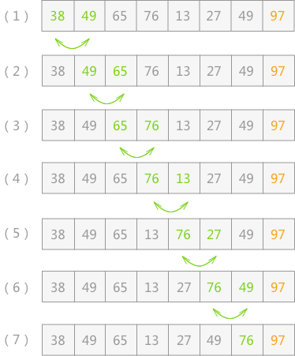

# 冒泡排序


## 算法简介

&emsp;&emsp;冒泡排序是一种计算机科学领域的较简单的排序算法，时间复杂度是O(n*n)，虽然运行效率较慢，但实现简单，适用于小数据的排序。 冒泡排序要重复的走访要排序的序列，一次比较相邻的两个元素，如果顺序错误就交换两者顺序，通过不断的交换来排序。


## 算法思想

&emsp;&emsp;冒泡排序是比较通过不断比较相邻的元素，通过不断的交换，将大的元素沉到底部，小的元素上浮的前面。

&emsp;&emsp;例如，对序列arr[] = {49，38，65，97，76，13，27，49}进行升序排序


&emsp;&emsp;经过第一次起泡后，最大的元素已经放到的序列的最后，然后继续进行第二次冒泡：



&emsp;&emsp;以此类推，经过8趟起泡后，序列便冒泡排序完成。每一趟的起泡都会将一个最大值移动到序列的后边。直到所有趟数起泡结束即完成排序。

## 代码示例

```c

void swap(int* a, int* b)
{
    int temp = *a;
    *a = *b;
    *b = temp;
}

void BubbleSort(int arr[],int n)
{
    for(int i=n-1;i>0;i--){
        for(int j=0;j<i;j++){
            if(arr[j] > arr[j+1]){
                swap(&arr[j],&arr[j+1]);
            }
        }
    }
}

```


